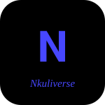

 

**Software engineer · Java & Python · Data engineering · Former designer**

I build concurrent servers, data pipelines and clean architecture, and I design the things I build.
 

 

 

<table align="center">
  <tr>
    <td align="center">
       
      
    </td>
    <td align="center">
       
      
    </td>
    <td align="center">
       
      
    </td>
  </tr>
</table>

**Nkuliverse**: my portfolio site, design work plus engineering case studies &nbsp;·&nbsp; **CollabSpace**: multi-tenant project management SaaS (Java, Spring Boot, React) &nbsp;·&nbsp; **Robot Worlds**: multi-client Java server with CI/CD

 

 

### [Creator Analytics Unification Dashboard](https://github.com/NkulAIR/creator-analytics-dashboard)
An ELT pipeline that pulls a creator's YouTube, Twitch and Patreon data into one PostgreSQL warehouse and serves a single Streamlit dashboard, so you can ask questions like "does posting more videos actually grow revenue?"
`Python` `PostgreSQL` `SQLAlchemy` `Streamlit` `Docker` · [Watch the demo](https://youtu.be/BU_csaYUBD0)

### TeamMzansi · AWS Summit Hackathon, 3rd place
A two-sided platform where South African citizens log municipal complaints and track progress, while authorised officials manage tickets and update status. Built with AWS Cognito and S3.
`Python` `AWS`

 

 

 

 

[Email](mailto:nkululekotshaka10@gmail.com) &nbsp;·&nbsp; [LinkedIn](https://linkedin.com/in/nkululeko-tshaka-040b71128) &nbsp;·&nbsp; [Portfolio](https://github.com/NkulAIR/Nkuliverse)

*Come back tomorrow*

